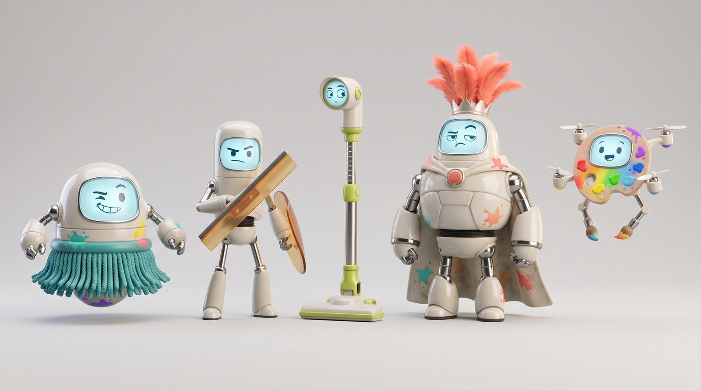

# PaintBlast MR — Meta VR Start Developer Competition 2026 plan

> Written 2026-10-01, alongside Round 7. Competition: <https://start-developer-competition-26.devpost.com/>
> Deadline **Nov 18 2026, 12:00 PT**. Judging Nov 18 – Dec 9; winners ~Dec 11. Build must stay live and
> unchanged until then. This file is the strategy; `docs/STATE.md` stays the source of truth for
> what the code does today.

## 1. The entry, in one paragraph

**Track: Gaming. Division: Adapted / Significantly Updated.** You can only pick one track per
submission, and you only get one entry. Entertainment is defined as *lean-back media* (spatial
cinema, music visualisation, interactive video). PaintBlast is active play, so it would be judged
against those and lose on "relevance to the chosen track". Gaming explicitly wants "hands-first …
casual … genres that thrive seated", which is a direct fit. Chill mode is still part of the entry:
it is the "creative, come back tomorrow" half of the pitch inside the Gaming track, not a second
entry. The game existed before Sep 24, so the New Experience division is out. The prizes are
identical anyway: $100k winner / $50k runner-up.

**The proof for "Adapted" already exists.** The Netlify production deploy of the pre-competition
build is dated **2026-08-19** and has an immutable permalink:
<https://6a8538f321c2e38c9f5fa08e--paintblast-mr.netlify.app>. Screenshot that deploy page now.
Never delete that deploy. The repo history alone cannot prove anything: it is a single squashed
commit dated Oct 1.

## 2. How we'll be judged

Four criteria, each worth 25%:

| Criterion | What judges look for | Where we are | What wins it |
|---|---|---|---|
| Innovation & Creativity | Originality, ambition, fit to the track, use of hands, gaze, passthrough and scene understanding | Strong concept: your real room is the paint canvas | One signature room-aware mechanic: robots that come *out of* your walls and furniture and hide behind your couch |
| Experience Design | Intuitive from the first second, clear onboarding, a habit-forming purpose, seated and hands-first, and the room should meaningfully change the experience | Core loop works. No onboarding, no progression, too many gestures | A diegetic 60-second tutorial, a daily challenge, a mural that persists in your room, and one hero gesture |
| Technical Implementation | 60 fps minimum, solid and bug-free, strategic use of hands, passthrough, MRUK and anchors, FoV-aware | Solid ECS core, 497 unit tests, room colliders. **No depth occlusion yet.** On IWSDK 0.3.1 | IWSDK 1.0 upgrade, depth occlusion, a proven 72 fps, anchors |
| Polish & Presentation | UI/UX, art direction, sound, a video of real gameplay | R7 improved lighting, paint, VFX and the hand UI. Art is still mixed-source | Consistent characters, a sound pass, and a tight trailer cut from real footage |

**Special awards ($25k each) to aim for**, in order of fit:

1. **Best First Five Minutes**: build onboarding as a feature, not a text panel.
2. **Best Reason to Come Back**: daily challenge, persistent room murals, painting gallery.
3. **Best Accessibility Forward**: seated by default, aim assist, a one-handed mode, colour-blind-safe ammo (shape + label + colour already exist), and no timer in Chill.
4. **Boldest Original Concept**: "your living room is the arena and the canvas."

Only chase Social/Multiplayer (colocated paint battle) if Phase 2 finishes early. It is the
largest scope item on this list.

## 3. Hard requirements: status after Round 7

| Requirement | Status | Remaining work |
|---|---|---|
| Fully usable with hands, end-to-end | ✅ in code (audit table in STATE.md): pinch START, pinch-select palette, pinch-hold reel, hands-only copy | **Prove it on device.** Quest Browser treats a *left* palm pinch as the menu button (exits the session), so test that the wrist palette pose never triggers it |
| Seated / "airplane seat" (2 ft radius) | 🟡 Robots spawn in a 150° forward arc; tether pops in your lap | Easel spawns 1.4 m away, out of reach when seated → seated distance ~0.65 m |
| Quick entry/exit, clean pause/resume | ✅ Pause on focus loss (timer, robots, tethers freeze and resume) | Measure cold start; consider resuming a round after the session is fully exited and re-entered |
| 60 fps minimum | ❓ Not measured on device since R6 | On-screen perf meter (dev flag), test a double pop with full VFX on Quest 3 **and 3S** |
| Purposeful passthrough + scene understanding | 🟡 Room mesh colliders, paint sticks to real walls, robots clamp to the room | **Depth occlusion is not on**: `DepthSensingSystem` is never registered, so the `DepthOccludable` tags do nothing, and IWSDK's occlusion ignores `instanceMatrix`, which would break the splats. Robots should use furniture |
| FoV-aware design (Glasses are 70×66°) | 🟡 HUD docks low during play | Run the `metavr device fov-sim` check. IWSDK 1.0 adds `fieldOfViewMask`. Keep robots and the HUD inside ±30° |
| Original content / IP | ⚠️ Risk (see §5) | Rebrand the web mechanic and gesture before the video is shot |
| Video under 3 min, real footage, on YouTube or Vimeo | ⬜ | §7 |
| Build live through Dec 11, frozen after the deadline | ⬜ | Production deploy on Nov 17. **No deploys after Nov 18** |

## 4. Roadmap to Nov 18

Each phase ends with tsc clean, tests green, `scripts/headless-verify.mjs` shots reviewed, and a
headset session.

**Phase 0: Round 7 (done 2026-10-01).** Shooters now lie along the forearm and shoot where they point. Tether reels smoothly with pull, pinch and hold. Palette is readable and holds still while you poke it. Pinch-to-select no longer fires. Easel grab is smoothed. Pause/resume works. Seated spawn arc. IBL, tone mapping, wet-paint balls, VFX, vivid sRGB colours, and a swept hit test.

**Phase 1: foundation and compliance (Oct 2 – Oct 14)**
- Device-test R7 on Quest 3 and 3S using the STATE.md checklist. Tune `WEB.handAimSource`, the `rayBlend*` and `PALETTE.hand*` knobs.
- Upgrade to **IWSDK 1.0.x** on its own branch, using the headless harness as the regression gate. This brings gaze+pinch, `fieldOfViewMask`, Glasses support, and is what the rules recommend.
- Turn on depth occlusion for robots and balls (`DepthSensingSystem`). Give the instanced splats their own occlusion fix, or exclude them.
- Make the seated easel distance the default. Add a perf meter.
- **Decide the rebrand (§5)** and consolidate gestures to one hero gesture plus pinch.

**Phase 2: the hook (Oct 15 – Oct 28)**
- *Room Raid*: robots emerge from **your** walls and furniture (scene mesh and planes), hide behind real objects (occlusion), and peek out. Paint reveals hidden ones.
- Four new characters with distinct behaviours (§6). A boss finale on round 3.
- A short round structure: 3 waves × 30 s with a results card. This keeps "a complete moment" well under 10 minutes.

**Phase 3: first five minutes and the return loop (Oct 29 – Nov 8)**
- **Onboarding by doing**, led by a guide character (§6). Each step unlocks the next: pinch to splat a target on your wall → tap a dab → hook and haul a robot → "you're ready". It can be skipped, and it never appears again after it is completed.
- **Reason to come back**:
  - a daily challenge seeded by date (colour + kind + target count);
  - your Chill mural persisted to the room with anchors, so it is still on your wall tomorrow;
  - a painting gallery (saved PNGs, with thumbnails in the HUD);
  - best-of-day and streak tracking, all stored locally.
- **Accessibility panel**: aim-assist strength, one-handed mode (both palette and firing on one hand), seated or standing, colour-blind patterns on splats.

**Phase 4: polish and proof (Nov 9 – Nov 15)**
- Sound pass: an original launch sound to replace "thwip", hit and pop variety, robot voice barks, and adaptive music.
- Art pass and performance pass.
- **Five external playtesters** (seated, hands only, never seen the game). Fix the top three issues.

**Phase 5: ship (Nov 16 – Nov 17)**
- Code freeze Nov 16. Final production deploy and smoke test (HEAD requests on assets) Nov 17.
- Submit **Nov 17**, a day early: Devpost forms queue up on deadline day.

## 5. IP and originality: a decision is needed

The web mechanic is our biggest compliance risk. The rules require original content: no brand
names, no commercial artwork, nothing that infringes third-party rights. Today the game has:

- a "thwip" gesture and sound;
- the middle-and-ring-curled hand sign, which this repo's own guide calls "the Spider-Man pose";
- white webbing fired from wrist "web shooters".

Three separate problems follow from that:

1. Judges at Meta will read it as derivative.
2. That hand sign is the *mano cornuta*, which is insulting in parts of Southern Europe. Meta's gesture guidance says not to use culturally loaded gestures.
3. Curled middle and ring fingers track poorly and occlude themselves.

**Recommendation:** keep the mechanic and change its identity so it belongs to a paint game.

- **"Goo Lines" / "Ink Grapple"**: wrist **paint launchers** that fire coloured goo strands in your loaded paint colour, never plain white.
- The hero gesture becomes the **punch-thrust**, which Meta says tracks better than a chop. The finger-curl gesture is retired.
- Rename the sound, the copy and every config label a player can see.

This costs about a day: it is mostly naming, strand colour and the gesture default. It removes
the risk entirely. Please confirm the name before Phase 1 ends.

## 6. Characters and assets: art bible for Meshy and Higgsfield

**Direction:** "Splotbots": chunky, toy-like cleaning robots that hate mess and that you
cover in paint. Glossy vinyl bodies, one big expressive face screen (an emissive texture swap
for emotions), and rounded silhouettes that read at 3 m. They must not look like The Nanauts,
the 2025 IWSDK winner's cute robots. Ours are domestic appliances gone rogue: mop heads,
spray nozzles, vacuum skirts.

*Concept v1, generated with Higgsfield `nano_banana_pro` (2 credits) from the template below.
Left to right: Mopsy, Squeegee, Peekaboo, Duster Duke, Pip. This shows a direction only.
Approve or redirect it before any 3D spend.*

| Character | Role | Silhouette and behaviour | Hit and pop |
|---|---|---|---|
| **Mopsy** | Basic hover target | Squat dome with a mop skirt. Drifts and bobs. | Mop fringe flicks; face shows 😵 |
| **Squeegee** | Shielded | Flat wiper-blade shield on its front arm that always turns to face you. Needs a Bouncy shot off a wall or a tether. | The shield gets painted over and falls off |
| **Peekaboo** | Room-aware | Hides behind your real furniture (scene mesh) and peeks out for 1.5 s | The surprised face is the tell |
| **Duster Duke** | Boss (wave 3) | Tall feather-duster crown, 6 HP, splits into two Mopsys | Crown feathers fly off as confetti |
| **Pip** | Onboarding guide and mascot | A floating paint-palette drone with brush arms that speaks short lines | Never shot. Celebrates your hits |

**Pipeline** (this extends the asset table in STATE.md):

1. **Concept art**: Higgsfield `nano_banana_pro`, one image per character. Use a front 3/4 view on a plain light-grey background, show the full body, and include no text, no logos and no other characters. Lock the style by reusing the first approved image as a reference.
2. **3D**:
   - **Meshy** image-to-3D for the characters, because it does auto-rigging and stock animations (idle, hit, flee) that Higgsfield's `generate_3d` does not.
   - Higgsfield `generate_3d` is fine for static props: a new gauntlet, the easel, the palette.
3. **Mesh budget**: one GLB per character, 5–10k triangles, a single 1–2k PBR material, and the face screen as a separate emissive material. Export in A-pose, facing −Z, at real-world scale or larger (the code measures and rescales at runtime). Compress with KTX2 textures and Draco or meshopt.
4. **Gauntlet replacement**: author the long axis along model −Z with the nozzle at the −Z end and the back of the hand at +Y, then set `WEB.shooterUseGlb`. No code change is needed.

**Prompt template** (concept art):

> "Stylized 3D toy robot character, glossy vinyl and soft rubber, chunky rounded proportions,
> household cleaning appliance theme: {ROLE DETAILS}. One large rounded face screen showing a
> simple emissive {EXPRESSION} face. Colour palette: off-white body, {ACCENT} accents, chrome
> joints. Full body, front three-quarter view, neutral light-grey studio background, soft key
> light, no text, no logos, no other objects. Clean silhouette readable at a distance. Game asset
> concept, Pixar-meets-designer-toy."

Substitute these for `{ROLE DETAILS}`:
- **Mopsy:** "a squat dome body floating above a skirt of thick mop strands, two stubby arms"
- **Squeegee:** "a slim upright body, one arm ending in a wide flat rubber squeegee blade used as a shield"
- **Peekaboo:** "a tall narrow body like a vacuum wand, a periscope head on a telescoping neck"
- **Duster Duke:** "a tall regal body, a crown of fluffy feather-duster plumes, a cape made of a cleaning cloth"
- **Pip:** "a small flying painter's-palette drone with four tiny propellers and two brush-tipped arms, a friendly face screen"

**Licensing:** confirm that the Higgsfield and Meshy plans in use grant commercial rights to their
outputs, and keep the receipts. The rules allow third-party assets only with authorisation, and
they say nothing against AI-generated 3D. They only ban AI-generated *video* in the pitch.

## 7. The video (under 3 minutes, real footage only)

Capture on device with Quest casting or MQDH recording. Use a seated player, hands only, in a
real living room.

| Time | Shot |
|---|---|
| 0:00–0:10 | Cold open: the player pinches, and paint explodes on their real wall. Title card |
| 0:10–0:35 | First five minutes, cut tight: Pip's tutorial |
| 0:35–1:20 | A Room Raid round: robots emerge from the walls, the player hooks one, hauls it in and pops it |
| 1:20–1:50 | Chill mode: painting on the easel, saving the canvas, the mural staying on the wall |
| 1:50–2:20 | Accessibility and seated play: one-handed mode, aim assist |
| 2:20–2:45 | The return loop: daily challenge, streak, gallery. End card with the live URL and QR code |

## 8. Submission checklist

- [ ] Devpost: name, tagline (≤140 chars), track **Gaming**, division **Adapted**, description (≤500 words), target launch date, team.
- [ ] "Summary of new features", with the Aug 19 permalink as the "before" and screenshots and changelog for the "after". STATE.md's round history is the source.
- [ ] Optional hand-interaction description: pinch to fire and select, punch-thrust, pull and pinch reel, a palette that holds still while poked, aim assist.
- [ ] Live URL (Netlify production), working on Quest 3 and 3S. Keep the QR code on the landing page.
- [ ] Video on YouTube or Vimeo, public, under 3:00.
- [ ] Start Program membership active. Meta developer account in good standing.

## 9. Decisions needed from you

1. **Rebrand the web mechanic** (§5)? Recommended: yes. Pick a name.
2. **Characters**: approve the Splotbots direction, or send another. After approval: Higgsfield concepts, then Meshy rigged GLBs.
3. **IWSDK 1.0 upgrade in Phase 1**? Recommended: yes, behind a branch with the harness as the gate.
4. **Multiplayer** (the Social award) as a stretch goal, or deliberately out of scope? Recommended: out of scope unless Phase 2 finishes by Oct 24.
